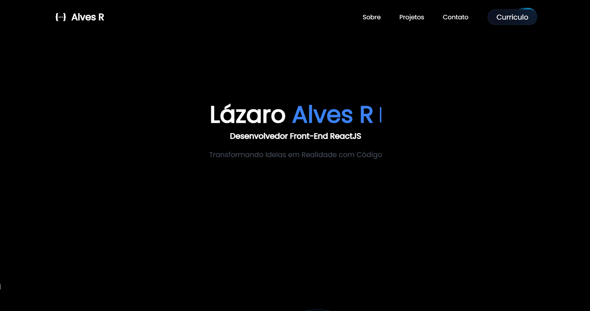

# Lázaro Alves Rodrigues - Desenvolvedor Full-Stack

Desenvolvedor front-end com 3 anos de experiência em desenvolvimento web, especializado em HTML, CSS, JavaScript, TypeScript, ReactJS, Next.js, Styled-Components e Tailwind CSS. Tenho ampla experiência em integração com APIs RESTful e gestão de projetos, desde a concepção até o deploy.

No back-end, sou proficiente em Node.js, NestJS com DDD, SQL, Docker, PostgreSQL e Prisma, permitindo-me criar soluções completas e escaláveis.

Explore meus projetos e conheça mais sobre minha trajetória no [meu portfólio.](https://www.lazaroalvesr.com/)

## Tecnologias Utilizadas:

- React.js: Para construção de interfaces interativas.
- Next.js: Para renderização do lado do servidor e otimização do - desempenho.
- Tailwind CSS: Para estilização responsiva e design moderno.

## Authors

- [@lazaroalvesr](https://github.com/lazaroalvesr)

## 🔗 Links

